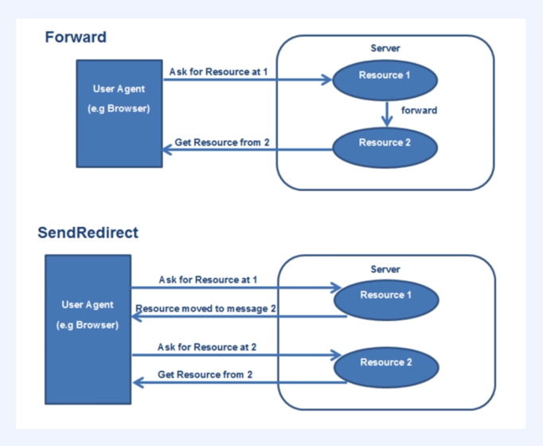
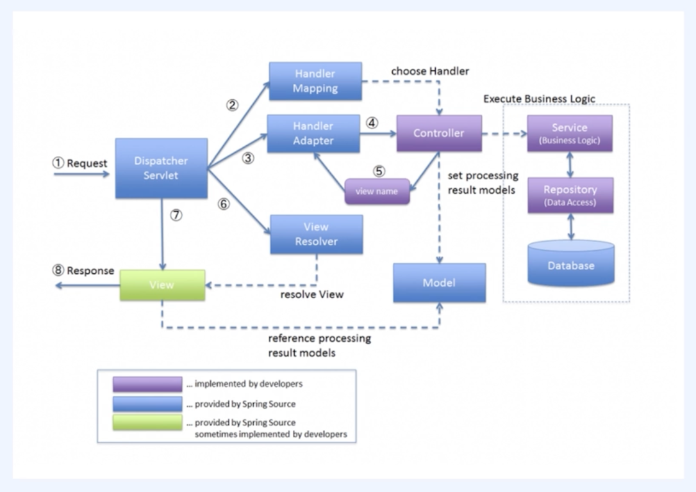

# 나만의 MVC 프레임워크 만들기

## Ch01~2. 강의 소개 및 개발환경 구성하기

### 🎯 학습 목표
1. 객체 지향 이해
2. HTTP 프로토콜 및 HTTP 웹 서버 동작 원리 이해
3. MVC 구조 및 DI 내부 동작 이해

## 🐳 도커(Docker)

### 🔹 컨테이너 기반의 가상화 플랫폼
- 앱은 **도커 엔진**을 통해 OS 자원을 사용함
- 여러 개의 프로세스를 **동시에 실행**하기 위한 도구 → `docker-compose`로 관리 가능

### 🔹 하이퍼바이저 기반의 가상화 플랫폼과 비교
- **하이퍼바이저 방식**은 게스트 OS와 호스트 OS가 각각 존재
- 반면, **도커는 호스트 OS 커널을 공유**하는 방식

## ⚙️ 톰캣 설정

### 🔧 Output Path 설정
- 경로: `Project Settings → Modules → output path` 지정

### 📁 톰캣 8의 표준 경로
- `/webapps/WEB-INF/classes`

### 🧩 작동 방식
- 서버 실행 시, 해당 경로에 `.class` 파일이 생성됨
- 톰캣은 해당 경로의 `.class` 파일을 읽어 **서버를 실행**

---

## Ch03. 객체지향 패러다임

### 객체지향 4가지 특성
1. 추상화
- 불필요한 부분을 제거하여 필요한 부분만 남긴 것, 복잡성을 낮춘다.
2. 다형성
- 다양한 형태를 가질 수 있는 것
3. 캡슐화
- 객체의 세부사항을 외부에 노출시키지 않는 것, 즉. 인터페이스만 제공
4. 상속
- 부모로 물려 받는 것

### 객체지향 5원칙(solid)
1. SRP: Single Responsibility Principle(단일책임 원칙)
- 하나의 책임만 갖는다.
2. OCP: Open/Closed Principle(개방폐쇄 원칙)
- 확장에는 열려있고 변경에는 닫혀있다.
3. LSP: Liskov's Substitution Principle(리스코프 치환의 원칙)
- 하위 타입의 객체를 상위 타입의 객체로 치환해도 문제가 없어야한다.(업캐스팅)
- 상위 타입->하위 타입 치환(다운캐스팅->런타임 오류가 발생할 수 있음. ex: 모든 사각형은 직사각형이다.(X))
4. ISP: Interface Segregation Principle(인터페이스 분리 원칙)
- 많은 기능을 갖는 인터페이스를 작은 기능으로 분리한다.
5. DIP: Dependency Interface Principle(의존성 역전 원칙)
- 자기보다 변경이 적은 것에 의존하라는 원칙
- 그런 것 보다 자신의 상태, 수행될 기능의 결정은 자신의 레이어가 아닌 상위 레이어에서 의존성 주입을 통해서 결정하라는 의미가 적절할 것 같다.

### 객체지향 패러다임
- 적절한 객체에게 적절한 책임을 할당하여 서로 메세지를 주고 받으며 협력하도록 하는 것
- 클래스가 아닌 객체에 초점을 맞춘다.
- 객체에게 얼마나 적절한 역할과 책임을 할당하는지가 중요하다.

1. 절차지향 vs 객체지향
- 책임이 한곳에 집중돼 있는 방식(getter)
- 책임이 여러 객체로 적절히 분산돼 있는 방식

2. 객체지향 설계 및 구현
- high cohesion, loose coupling
- 서랍 정리와 비슷할 수 있다.(비슷한 성격 끼리는 모으고, 다른 성격 끼리는 분리)
- 변경이 일어났을 때 다른 곳에 영향이 적어야한다.
- 6가지 객체지향 설계 순서
    - 도메인을 구성하는 객체에는 어떤 것들이 고민
    - 객체들 간의 관계를 고민
    - 동적인 객체를 정적인 타입으로 추상화(공통화)해서 도메인 모델링 하기
    - 협력을 설계
    - 객체들을 포괄하는 타입에 적절한 책임을 할당
    - 구현하기

## Ch06. MVC 프레임워크 만들기
### 01. 리플렉션 API 개념 소개 및 실습
- 리플렉션(Reflection)이란?
  - 리플렉션은 자바에서 런타임에 클래스, 메서드, 필드 등의 정보를 조회하거나 조작할 수 있는 기능을 말함.
  - 주요 용도
    - 프레임워크(예: Spring)에서 애노테이션 기반 설정을 처리할 때
    - 테스트 프레임워크, DI 컨테이너, ORM, 직렬화 도구 등에서 자주 사용됨

- 주요 테스트 메서드 설명
1. 어노테이션이 붙은 클래스 스캔
   ```java
       @Target(ElementType.TYPE)
       @Retention(RetentionPolicy.RUNTIME) // 유지기간 설정
       public @interface Controller {
       }
   ```
   - 컨트롤러 어노테이션 선언이며 `클래스`, `인터페이스`, `enum` 등의 타입에만 붙을 수 있으며, 런타임까지 유지된다는 의미(리플렉션 가능)
   ```java
       Reflections reflections = new Reflections("com.example");
       Set<Class<?>> beans = new HashSet<>();
       annotations.forEach(annotation -> beans.addAll(reflections.getTypesAnnotatedWith(annotation)));
   ```
   - org.reflections.Reflections 라이브러리를 사용해 com.example 패키지 하위에서 @Controller, @Service 애노테이션이 붙은 클래스를 모두 탐색

2. 일반 객체(클래스) 스캔
   ```java
       Class<User> clazz = User.class;

       User user = new User("serverwizard", "kyun");
       Class<? extends User> clazz2 = user.getClass();

       Class<?> clazz3 = Class.forName("com.example.model.User");
   ```
   - 힙 영역에 로드되어있는 클래스 타입 객체를 로드하는 3가지 방법
   ```java
       Class<User> clazz = User.class;

       logger.debug("class: [{}]", clazz.getName());
       logger.debug("User all declared fields: [{}]", Arrays.stream(clazz.getDeclaredFields()).collect(Collectors.toSet()));
       logger.debug("User all declared constructors: [{}]", Arrays.stream(clazz.getDeclaredConstructors()).collect(Collectors.toSet()));
       logger.debug("User all declared methods: [{}]", Arrays.stream(clazz.getDeclaredMethods()).collect(Collectors.toSet()));
   ```
   - User 클래스의 필드, 생성자, 메서드 정보를 런타임에 조회할 수 있다.
   - getDeclaredXxx()는 private 포함 모든 선언된 정보를 가져옴

3. 핵심 요약
   - Class.forName(패키지경로): 클래스 이름 문자열로 클래스 객체 로딩
   - 객체.class: 클래스 이름으로 객체 획득 
   - 인스턴스.getClass(): 인스턴스 기반 클래스 객체 획득
   - getDeclaredXXX():	필드, 생성자, 메서드 정보 조회
   - Reflections.getTypesAnnotatedWith(...): 패키지 기준 애노테이션 스캔 가능
   
### 02~3. 프런트 컨트롤러 패턴
- 로그백 설정
  - ✅ logback.xml이란?
    - Logback 로깅 프레임워크의 설정 파일
    - 로그의 출력 대상, 출력 형식, 로그 레벨 등을 정의
  - ✅ 주요 구성 요소
    - <appender>
      로그를 어디에 출력할지 지정
      예: 콘솔, 파일, DB 등
    - <logger>
      특정 패키지나 클래스에 대한 로그 레벨 지정  
    - <root>
      전체 애플리케이션의 기본 로그 레벨 및 Appender 연결 
  - ✅ 예시 요약
  ``` xml
      <appender name="STDOUT" class="ConsoleAppender">  ← 콘솔 출력
      <logger name="com.example" level="DEBUG"/>        ← 특정 패키지 DEBUG 출력
      <root level="INFO">                                ← 기본 로그는 INFO 이상
  ```
- forward vs redirect 방식


| 항목        | forward                          | redirect                           |
|-------------|-----------------------------------|-------------------------------------|
| 동작 방식   | 서버 내부에서 이동                | 클라이언트가 새 요청을 보내도록 유도 |
| 요청/응답   | 기존 Request/Response 재사용      | 새로운 Request/Response 생성         |
| URL 변경    | 변경되지 않음                     | 변경됨                              |
| 속도        | 빠름                              | 상대적으로 느림                     |
| 주 용도     | 내부 자원 이동 (예: JSP 연결)       | 외부 이동, PRG 패턴 등               |

- 
### 04~5. MVC 프레임 워크 만들기

## DispatcherServlet 전체 요청 처리 흐름
```
[HTTP 요청] → DispatcherServlet → HandlerMapping → HandlerAdapter → Controller 실행 → 처리내용 반환 → ViewResolver → View 렌더링 → [HTTP 응답]
```
## DispatchServlet 기본구조
``` java
@WebServlet("/")
public class DispatcherServlet extends HttpServlet {
    @Override
    public void init() {
        // 초기화 로직
    }

    @Override
    protected void service(HttpServletRequest request, HttpServletResponse response) throws ServletException {
        // 요청 처리 로직
    }
```
- `HttpServlet`을 상속
- 톰캣이 실행되면 `init()` 실행
- 클라이언트의 요청이 오면 `service()`를 호출
## DispatcherServlet init() - 컴포넌트 초기화
``` java
@Override
public void init() {
    RequestMappingHandlerMapping rmhm = new RequestMappingHandlerMapping();
    rmhm.init();

    AnnotationHandlerMapping ahm = new AnnotationHandlerMapping("com.example.mvc");
    ahm.initialize();

    handlerMappings = List.of(rmhm, ahm);
    handlerAdapters = List.of(new SimpleControllerHandlerAdapter(), new AnnotationHandlerAdapter());
    viewResolvers = Collections.singletonList(new JspViewResolver());
}
```
1. `RequestMappringHandlerMapping`: 전통적인 방식으로 URL과 컨트롤러 매핑
``` java
public class RequestMappingHandlerMapping implements HandlerMapping {
    private Map<HandlerKey, Controller> mappings = new HashMap<>();

    void init() {
        mappings.put(new HandlerKey("/user/form", RequestMethod.GET), new ForwardController("/user/form"));
        mappings.put(new HandlerKey("/users", RequestMethod.GET), new UserListController());
        mappings.put(new HandlerKey("/users", RequestMethod.POST), new UserCreateController());
    }
}
```
- URL + HTTP Method 를 기준으로 컨트롤러 매핑
- Controller 예시(UserListController)
``` java
public class UserListController implements Controller {

    @Override
    public String handleRequest(HttpServletRequest req, HttpServletResponse resp) throws Exception {
        req.setAttribute("users", UserRepository.findAll());
        return "/user/list";
    }
}
```
    - `users` 리스트를 request에 설정
    - 뷰 이름(`/user/list`) 반환
2. `AnnotationHandlerMapping`: 어노테이션 기반으로 매핑
``` java
public class AnnotationHandlerMapping implements HandlerMapping {
    public void initialize() {
        Reflections reflections = new Reflections(basePackage);

        Set<Class<?>> clazzesWithControllerAnnotation = reflections.getTypesAnnotatedWith(Controller.class, true);

        clazzesWithControllerAnnotation.forEach(clazz ->
                Arrays.stream(clazz.getDeclaredMethods()).forEach(declaredMethod -> {
                    RequestMapping requestMappingAnnotation = declaredMethod.getDeclaredAnnotation(RequestMapping.class);

                    if (requestMappingAnnotation == null) return; // 예외 처리

                    Arrays.stream(getRequestMethods(requestMappingAnnotation))
                            .forEach(requestMethod -> {
                                HandlerKey key = new HandlerKey(requestMappingAnnotation.value(), requestMethod);
                                AnnotationHandler handler = new AnnotationHandler(clazz, declaredMethod);
                                handlers.put(key, handler);
                            });
                })
        );
    }
}
```
    - 리플렉션을 이용하여 `@Controller`이 붙은 클래스를 탐색
    - 탐색한 클래스를 핸들러에 등록
    - Controller 예시(HomeController)
``` java
@Controller
public class HomeController {
    @RequestMapping(value = "/", method = RequestMethod.GET)
    public String handleRequest(HttpServletRequest request, HttpServletResponse response) {
        request.setAttribute("users", UserRepository.findAll());
        return "home";
    }
}
```
3. `handlerMappings = List.of(rmhm, ahm)`
    - 찾은 컨트롤러 객체를 리스트에 등록
4. `andlerAdapters = List.of(new SimpleControllerHandlerAdapter(), new AnnotationHandlerAdapter())`
    - 찾은 handler(컨트롤러 객체)를 실제로 "어떻게 실행할지" 결정.
5. `viewResolvers = Collections.singletonList(new JspViewResolver())`
    - view를 처리할 viewResolvers을 생성
## DispatcherServlet service() - 클라이언트 요청 처리
``` java
@Override
protected void service(HttpServletRequest request, HttpServletResponse response) throws ServletException {
    String requestURI = request.getRequestURI();
    RequestMethod requestMethod = RequestMethod.valueOf(request.getMethod());

    Object handler = handlerMappings.stream()
            .filter(hm -> hm.findHandler(new HandlerKey(requestURI, requestMethod)) != null)
            .map(hm -> hm.findHandler(new HandlerKey(requestURI, requestMethod)))
            .findFirst()
            .orElseThrow(() -> new ServletException("No handler for [" + requestMethod + ", " + requestURI + "]"));

    try {
        HandlerAdapter handlerAdapter = handlerAdapters.stream()
                .filter(ha -> ha.supports(handler))
                .findFirst()
                .orElseThrow(() -> new ServletException("No adapter for handler [" + handler + "]"));

        ModelAndView modelAndView = handlerAdapter.handle(request, response, handler);

        for (ViewResolver viewResolver : this.viewResolvers) {
            View view = viewResolver.resolveViewName(modelAndView.getViewName());
            view.render(modelAndView.getModel(), request, response);
        }
    } catch (Throwable e) {
        logger.error("exception occurred: [{}]", e.getMessage(), e);
        throw new ServletException(e);
    }
}
```
1. 요청 URI + METHOD 추출
2. HandlerMapping 통해 handler(컨트롤러) 탐색
   - 등록된 `handlerMappings`들을 순회하면서, `requestURI + METHOD`에 해당하는 컨트롤러(handler)를 찾음
   - 없으면 예외처리(500 에러 발생)
3. HandlerAdapter 통해 handler 실행
   - 찾은 handler를 실제로 실행시킬 수 있는 `HandlerAdapter` 탐색
   - `supports(handler)`로 일치하는 객체타입의 핸들러 확인
   - 없으면 예외처리
4. ModelAndView 반환: handlerAdapter로 해당하는 컨트롤러의 view name 값을 가져온다.
5. View.render() 실행 → 응답 생성
   - jsp는 `forward`으로 처리(request.getRequestDispatcher(name).forward(request, response))
   - 리다이렉트는 `sendRedirect`로 처리(response.sendRedirect(name))
   - model의 data 처리는 모델엔뷰에서 처리하는 것이 아닌 request에서 처리한다.(모델엔뷰에서 처리하는 것이 맞는 것 같음.)
